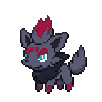

<h2>
  Hi, I'm Quinn!
  
</h2>
<p><em>Student Software Developer at <a href="https://www.linkedin.com/school/bit-academy-nl/">Bit Academy</a></em></p>

<br>

<h3>Who am I, exactly?</h3>

```javascript
const quinn = {
  pronouns: "he" | "they",
  code: [JavaScript, TypeScript, HTML, CSS, PHP, Python, Lua],
  stash: [React, Next.js, Node, Tailwind, Sass, MySQL],
  traits: {
    curios: "Curiosity is always at its strongest.",
    ambition: "Always in a need to explore, discover, and learn more.",
    perfectionistic: "It's a blessing and a curse."
  },
  currentFoci: [
    "Improving my React and Next.js knowledge and skills.",
    "Getting into back-end development.",
    "Clarifying what dreams I want to follow.",
  ]
}
```

<br>

<h3>Seems like you've stumbled onto the undermost section of my profile!</h3>
<p><em>Well, I better tell you just a bit more about myself, huh?</em></p>

- ✨ I'm a student at Bit Academy. An aspiring Software Developer who's always eager to explore beyond the boundaries!
- 💖 Nintendo's my passion! Don't even get me started on how incredibly much I love Pokémon!
- 🥪 As some might know, I do have an exceptional love for grilled cheese sandwiches!
